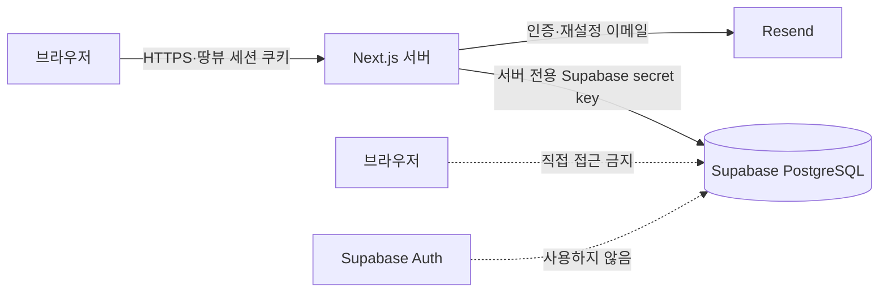

# 땅뷰 회원가입·로그인·후기 구현 계획

- 작성일: 2026-07-30
- 대상: Next.js App Router + Vercel + Supabase PostgreSQL
- 인증 방식: 땅뷰 자체 `users` 테이블과 데이터베이스 세션
- 제외 범위: Supabase Auth, `auth.users`, Supabase 세션/JWT, RLS

## 1. 확정 결정

1. 회원 원장은 Supabase PostgreSQL의 `public.users` 테이블이다.
2. PostgreSQL 예약어와 혼동되는 단수형 `user` 대신 `users`를 테이블명으로 사용한다.
3. 비밀번호 검증, 세션 생성, 로그인 상태 확인, 후기 작성 권한 검사는 모두 땅뷰 서버에서 수행한다.
4. 브라우저는 Supabase를 직접 호출하지 않고 Next.js Route Handler 또는 Server Action만 호출한다.
5. Supabase Auth API와 `auth.users`는 사용하지 않는다.
6. RLS 정책은 만들지 않으며 관련 테이블의 RLS를 명시적으로 비활성화한다.
7. RLS를 대신해 `anon`·`authenticated` 역할의 테이블 권한을 회수하고 서버 비밀 키를 사용하는 `service_role`만 접근시킨다.
8. 후기 조회는 비회원도 가능하지만 생성·수정·삭제는 로그인한 사용자만 가능하다.
9. 첫 출시의 후기는 땅뷰 서비스 후기로 시작하고, `target_type`과 `target_key`를 두어 향후 필지(PNU) 후기 등으로 확장한다.

## 2. 요청 흐름과 보안 경계



- 브라우저 번들에는 Supabase URL, publishable/anon key, secret/service role key를 넣지 않는다.
- 서버 전용 Supabase 클라이언트는 `server-only` 모듈 한 곳에서 생성한다.
- `@supabase/ssr`와 Supabase Auth 세션 도우미를 사용하지 않는다.
- 서버 클라이언트는 `persistSession: false`, `autoRefreshToken: false`, `detectSessionInUrl: false`로 생성한다.
- 사용자 입력을 받은 모든 Route Handler와 Server Action은 공개 API라고 가정하고 세션·소유권·역할을 다시 검사한다.

## 3. RLS를 사용하지 않는 데이터베이스 권한 모델

Supabase는 기본적으로 `public` 스키마의 객체를 Data API에 노출할 수 있다. 이번 설계에서는 RLS를 사용하지 않으므로 테이블 권한을 기본 거부 상태로 바꾸는 작업이 필수다.

마이그레이션 원칙:

```sql
alter table public.users disable row level security;
alter table public.user_sessions disable row level security;
alter table public.user_action_tokens disable row level security;
alter table public.auth_rate_limits disable row level security;
alter table public.reviews disable row level security;

revoke all on schema public from anon, authenticated;
grant usage on schema public to service_role;

revoke all on table public.users from public, anon, authenticated;
revoke all on table public.user_sessions from public, anon, authenticated;
revoke all on table public.user_action_tokens from public, anon, authenticated;
revoke all on table public.auth_rate_limits from public, anon, authenticated;
revoke all on table public.reviews from public, anon, authenticated;

grant select, insert, update, delete
on table public.users, public.user_sessions, public.user_action_tokens,
  public.auth_rate_limits, public.reviews
to service_role;

alter default privileges for role postgres in schema public
  revoke all on tables from public, anon, authenticated;
alter default privileges for role postgres in schema public
  revoke all on sequences from public, anon, authenticated;
alter default privileges for role postgres in schema public
  revoke all on functions from public, anon, authenticated;
```

추가 조치:

- 새 테이블·시퀀스·함수의 기본 권한에서도 `anon`, `authenticated` 접근을 회수한다.
- 마이그레이션 테스트에서 publishable/anon key로 네 테이블을 읽거나 수정할 수 없는지 확인한다.
- 서버의 secret/service role key는 Vercel과 로컬 `.env`에만 저장하고 로그·에러 응답에 출력하지 않는다.
- 관리자 기능도 service role 보유 여부로 판단하지 않고 `users.role`을 서버에서 확인한다.
- RLS가 없으므로 서버 코드의 누락된 `WHERE user_id = ...`가 곧 권한 취약점이 된다. 데이터 접근 계층에서 소유권 검사를 공통 함수로 강제한다.

## 4. 데이터 모델

### 4.1 `users`

| 필드 | 형식 | 설명 |
|---|---|---|
| `id` | `uuid PK` | 외부에 노출 가능한 임의 식별자 |
| `email` | `text unique` | 소문자·공백 제거 후 저장 |
| `password_hash` | `text` | Argon2id 결과만 저장 |
| `nickname` | `text` | 후기 작성자 표시 이름 |
| `role` | `text` | `member`, `moderator`, `admin` |
| `status` | `text` | `pending`, `active`, `suspended`, `deleted` |
| `email_verified_at` | `timestamptz nullable` | 이메일 인증 시각 |
| `terms_agreed_at` | `timestamptz` | 이용약관 동의 |
| `privacy_agreed_at` | `timestamptz` | 개인정보 수집 동의 |
| `password_changed_at` | `timestamptz` | 전체 세션 무효화 기준 |
| `last_login_at` | `timestamptz nullable` | 최근 로그인 |
| `created_at`, `updated_at` | `timestamptz` | 생성·변경 시각 |
| `deleted_at` | `timestamptz nullable` | 탈퇴 소프트 삭제 |

제약:

- 이메일은 정규화 후 유일해야 한다.
- 닉네임 길이와 허용문자 규칙을 서버와 DB에서 함께 검사한다.
- 비밀번호 원문, 복호화 가능한 비밀번호, 빠른 SHA 계열 비밀번호 해시는 저장하지 않는다.
- `status = active`이고 이메일 인증이 끝난 사용자만 로그인시킨다.

### 4.2 `user_sessions`

| 필드 | 형식 | 설명 |
|---|---|---|
| `id` | `uuid PK` | 세션 레코드 ID |
| `user_id` | `uuid FK users` | 로그인 사용자 |
| `token_hash` | `text unique` | 쿠키의 원본 토큰을 SHA-256 해시한 값 |
| `expires_at` | `timestamptz` | 절대 만료 시각 |
| `last_seen_at` | `timestamptz` | 최근 검증 시각 |
| `revoked_at` | `timestamptz nullable` | 로그아웃·강제 종료 |
| `created_at` | `timestamptz` | 생성 시각 |
| `user_agent_hash`, `ip_hash` | `text nullable` | 이상 징후 탐지용 최소 정보 |

세션 쿠키:

- 이름: `__Host-landview_session`
- 32바이트 이상의 암호학적 난수 사용
- `HttpOnly`, `Secure`, `SameSite=Lax`, `Path=/`
- `Domain` 속성은 설정하지 않는다.
- 원본 세션 토큰은 쿠키에만 두고 데이터베이스에는 해시만 저장한다.
- 초기 만료는 14일로 하되 비밀번호 변경·계정 정지·탈퇴 시 모든 세션을 즉시 폐기한다.
- 로컬 HTTP 개발에서는 별도의 개발용 쿠키명을 사용하고, 운영 HTTPS에서만 `__Host-` 쿠키를 사용한다.

### 4.3 `user_action_tokens`

이메일 인증과 비밀번호 재설정 토큰을 통합 관리한다.

| 필드 | 형식 | 설명 |
|---|---|---|
| `id` | `uuid PK` | 토큰 레코드 |
| `user_id` | `uuid FK users` | 대상 사용자 |
| `purpose` | `text` | `verify_email`, `reset_password`, `change_email` |
| `token_hash` | `text unique` | 원본 토큰의 해시 |
| `payload` | `jsonb` | 이메일 변경 등 최소 부가정보 |
| `expires_at` | `timestamptz` | 짧은 만료시간 |
| `used_at` | `timestamptz nullable` | 일회성 사용 완료 |
| `created_at` | `timestamptz` | 생성 시각 |

- 인증·재설정 링크에는 원본 토큰을 넣고 DB에는 해시만 저장한다.
- 사용 완료, 만료, 새 토큰 발급 시 기존 토큰을 무효화한다.
- 존재하는 이메일인지 외부 응답으로 구분하지 않는다.

### 4.4 `auth_rate_limits`

Vercel의 여러 서버 인스턴스가 동일한 요청 제한 상태를 사용하도록 Supabase에 요청 횟수를 저장한다.

| 필드 | 형식 | 설명 |
|---|---|---|
| `action` | `text PK` | `signup`, `login`, `forgot`, `verify`, `reset`, `review` |
| `key_hash` | `text PK` | IP·이메일·사용자 식별값을 해시한 값 |
| `window_started_at` | `timestamptz` | 제한 구간 시작 |
| `request_count` | `integer` | 해당 구간 요청 횟수 |
| `updated_at` | `timestamptz` | 최근 요청 시각 |

- 서버는 `consume_auth_rate_limit` 함수를 `service_role`로만 호출한다.
- 원본 IP와 이메일은 이 테이블에 저장하지 않는다.
- `anon`, `authenticated` 역할의 테이블 및 함수 실행 권한을 회수한다.

### 4.5 `reviews`

| 필드 | 형식 | 설명 |
|---|---|---|
| `id` | `uuid PK` | 후기 ID |
| `user_id` | `uuid FK users` | 작성 회원 |
| `target_type` | `text` | 초기값 `site`, 향후 `parcel` 등 |
| `target_key` | `text` | 초기값 `landview`, 필지 후기는 PNU |
| `rating` | `smallint` | 1~5점 |
| `title` | `text nullable` | 선택 제목 |
| `content` | `text` | 일반 텍스트 후기 |
| `status` | `text` | `published`, `hidden`, `deleted` |
| `edited_at` | `timestamptz nullable` | 수정 시각 |
| `created_at`, `updated_at` | `timestamptz` | 생성·변경 시각 |
| `deleted_at` | `timestamptz nullable` | 소프트 삭제 시각 |

제약:

- `rating between 1 and 5`
- 내용은 서버에서 공백 제거 후 5자 이상, 1,000자 미만으로 제한한다.
- 첫 출시에는 사용자당 대상별 공개 후기 1개만 허용한다.
- 수정·삭제는 작성자 본인 또는 `moderator`·`admin`만 가능하다.
- 삭제는 감사와 분쟁 대응을 위해 우선 소프트 삭제하고 공개 조회에서 제외한다.
- 공개 응답에는 이메일·내부 사용자 상태를 포함하지 않고 닉네임과 필요한 후기 필드만 반환한다.

후속 테이블:

- `review_reports`: 후기 신고
- `review_moderation_logs`: 숨김·복구·삭제 등 관리자 조치 이력

### 4.6 공개 후기 뷰

- `review_public_feed`: 메인 홈과 후기 목록에 필요한 후기·닉네임 필드만 제공한다.
- `review_public_summary`: 대상별 공개 후기 수와 평균 평점을 제공한다.
- 두 뷰 모두 `published` 후기와 `active` 사용자만 포함한다.
- 이메일, 사용자 ID, 비밀번호 해시, 계정 상태, 세션 정보는 공개 뷰에 포함하지 않는다.
- 브라우저가 뷰를 직접 조회하지 않고 땅뷰 서버가 `service_role`로 읽어 DTO를 반환한다.

## 5. 회원 인증 흐름

### 5.1 회원가입

1. 서버에서 이메일, 비밀번호, 닉네임, 필수 동의를 검증한다.
2. 이메일을 정규화하고 중복 여부를 검사한다.
3. 비밀번호는 Node.js 런타임에서 Argon2id로 해시한다.
4. `users.status = pending`으로 생성한다.
5. 일회성 이메일 인증 토큰을 만들고 해시만 저장한다.
6. 기존 Resend 연동으로 인증 링크를 전송한다.
7. 인증 성공 시 `email_verified_at`과 `status = active`를 기록한다.

### 5.2 로그인

1. 이메일과 비밀번호를 서버에서 검증한다.
2. 사용자 존재 여부와 관계없이 외부에는 동일한 오류 문구를 반환한다.
3. Argon2id로 비밀번호를 검증하고 `active` 상태와 이메일 인증 여부를 확인한다.
4. 암호학적 난수 세션 토큰을 생성한다.
5. 토큰 해시를 `user_sessions`에 저장하고 원본은 서버에서 HttpOnly 쿠키로 설정한다.
6. 로그인 성공 후 `last_login_at`을 갱신한다.

### 5.3 요청 인증

1. 서버가 쿠키에서 원본 세션 토큰을 읽는다.
2. SHA-256 해시로 변환해 `user_sessions`를 조회한다.
3. 만료·폐기 여부와 연결된 사용자의 `status`, `password_changed_at`을 확인한다.
4. DTO에는 `id`, `nickname`, `role` 등 필요한 정보만 포함한다.
5. 후기 작성·수정·삭제 시 같은 요청 안에서 세션과 소유권을 다시 확인한다.

### 5.4 로그아웃·비밀번호 재설정·탈퇴

- 로그아웃: 현재 세션의 `revoked_at` 기록 후 쿠키 삭제
- 전체 로그아웃: 사용자의 활성 세션 전체 폐기
- 비밀번호 재설정: 일회성 토큰 검증 후 해시 교체, 모든 기존 세션 폐기
- 탈퇴: 사용자 상태 변경, 세션 폐기, 후기 숨김 또는 익명화 정책 적용

## 6. 서버 API 계약

### 인증 API

| 메서드·경로 | 인증 | 역할 |
|---|---|---|
| `POST /api/auth/signup` | 불필요 | 회원 생성·인증메일 발송 |
| `POST /api/auth/verify-email` | 토큰 | 이메일 인증 완료 |
| `POST /api/auth/login` | 불필요 | 로그인·세션 쿠키 생성 |
| `POST /api/auth/logout` | 필요 | 현재 세션 폐기 |
| `GET /api/auth/me` | 선택 | 현재 사용자 최소 DTO |
| `POST /api/auth/forgot-password` | 불필요 | 재설정 메일 요청 |
| `POST /api/auth/reset-password` | 토큰 | 비밀번호 교체·세션 폐기 |

### 후기 API

| 메서드·경로 | 인증 | 역할 |
|---|---|---|
| `GET /api/reviews` | 불필요 | 공개 후기 페이지네이션 조회 |
| `POST /api/reviews` | 필수 | 로그인 사용자 후기 생성 |
| `PATCH /api/reviews/:id` | 필수 | 작성자 본인 후기 수정 |
| `DELETE /api/reviews/:id` | 필수 | 작성자 본인 후기 소프트 삭제 |
| `GET /api/account/reviews` | 필수 | 내 후기 조회 |

공통 응답:

- 인증 없음: `401`
- 로그인했지만 소유권·역할 없음: `403`
- 중복 후기: `409`
- 유효성 오류: `400`
- 오류 응답에 사용자 존재 여부, 비밀번호 해시, 토큰, Supabase 원문 오류를 노출하지 않는다.

## 7. UI 계획

### 페이지

- `/signup`: 이메일, 비밀번호, 비밀번호 확인, 닉네임, 필수 동의
- `/login`: 이메일, 비밀번호, 비밀번호 찾기
- `/verify-email`: 인증 진행·완료·만료 안내
- `/forgot-password`, `/reset-password`: 재설정 흐름
- `/account`: 회원정보, 내 후기, 전체 로그아웃, 탈퇴

### 공통 헤더

- 비로그인: `로그인`, `회원가입`
- 로그인: 닉네임, `내 계정`, `로그아웃`
- 서버에서 세션을 확인한 결과로 렌더링하며 브라우저 상태만으로 권한을 판단하지 않는다.

### 후기

- 공개 목록: 평균 평점, 후기 수, 최신순 페이지네이션
- 비로그인 작성 영역: 입력 폼 대신 `로그인 후 후기 작성` 버튼
- 로그인 사용자: 별점, 제목, 내용, 등록 버튼
- 내 후기: 수정·삭제 버튼
- 관리자: 숨김·복구 기능은 2차 범위

### 메인 홈 후기 섹션

- 메인 홈의 서비스 설명 영역 뒤, 최종 CTA 앞에 `사용자 후기` 섹션을 배치한다.
- `review_public_summary`의 평균 평점과 전체 후기 수를 섹션 상단에 표시한다.
- `target_type = site`, `target_key = landview`인 최신 공개 후기 3개를 카드로 표시한다.
- 카드에는 별점, 닉네임, 작성일, 제목, 본문 일부만 표시하고 이메일과 사용자 ID는 노출하지 않는다.
- `후기 전체보기`는 `/reviews`로 연결한다.
- 비로그인 사용자는 `로그인 후 후기 작성`, 로그인 사용자는 `후기 작성` 또는 `내 후기 수정` CTA를 본다.
- 공개 후기가 0개이면 샘플 후기를 만들지 않고 `첫 후기를 기다리고 있습니다`라는 빈 상태를 표시한다.
- 홈에서는 Supabase를 직접 호출하지 않고 서버 데이터 접근 계층을 사용한다.
- 후기 등록·수정·삭제 후 홈과 `/reviews`의 캐시 태그를 무효화한다.

## 8. 서버 코드 구조

```text
src/lib/supabase/server.ts       # server-only Supabase client
src/lib/auth/password.ts         # Argon2id 해시·검증
src/lib/auth/session.ts          # 세션 생성·조회·폐기·쿠키
src/lib/auth/authorization.ts    # requireUser, requireRole
src/lib/auth/tokens.ts           # 인증·재설정 토큰
src/lib/validation/auth.ts       # 회원 입력 스키마
src/lib/validation/review.ts     # 후기 입력 스키마
src/data-access/users.ts         # 사용자 쿼리
src/data-access/sessions.ts      # 세션 쿼리
src/data-access/reviews.ts       # 공개·소유자·관리자 쿼리
src/lib/auth/rate-limit.ts       # Supabase 공유 요청 제한
app/api/auth/...                 # 인증 Route Handlers
app/api/reviews/...              # 후기 Route Handlers
supabase/migrations/...          # 테이블·인덱스·권한 SQL
```

원칙:

- 주요 의존성은 `@supabase/supabase-js`, `@node-rs/argon2`, `zod`로 제한한다.
- 컴포넌트나 Route Handler에서 Supabase 쿼리를 직접 흩뿌리지 않는다.
- 모든 DB 접근은 데이터 접근 계층을 거친다.
- 공개 후기 DTO와 내부 후기 레코드 타입을 분리한다.
- 비밀번호 해싱 때문에 인증 Route Handler는 Edge가 아니라 Node.js 런타임을 사용한다.
- 최초 마이그레이션은 [`202607300001_create_custom_auth_and_reviews.sql`](../supabase/migrations/202607300001_create_custom_auth_and_reviews.sql)을 적용한다.

## 9. 보안 요구사항

- 비밀번호: Argon2id, 사용자별 salt, 선택적 서버 pepper
- 세션: 예측 불가능한 opaque token, DB에는 해시만 저장
- 쿠키: `HttpOnly`, `Secure`, `SameSite=Lax`, `Path=/`, `__Host-` 접두사
- CSRF: SameSite 쿠키와 함께 상태 변경 요청의 `Origin` 검증
- 입력 검증: 서버 스키마 검증, 후기 일반 텍스트 처리, 길이 제한
- 요청 제한: 이메일·IP 기준 회원가입, 로그인, 인증메일, 재설정, 후기 작성 rate limit
- 계정 열거 방지: 로그인·비밀번호 찾기 응답을 동일하게 처리
- 세션 고정 방지: 로그인·비밀번호 변경 시 새 세션 발급 및 기존 세션 폐기
- IDOR 방지: 후기 수정·삭제 쿼리에 `id`와 `user_id`를 함께 사용
- 캐시: 인증·계정 응답은 `Cache-Control: no-store`
- 로그: 비밀번호, 원본 세션 토큰, 인증·재설정 토큰, 전체 이메일을 기록하지 않는다.
- 비밀 키: `NEXT_PUBLIC_` 접두사 금지, 클라이언트 import 금지, 주기적 교체
- 운영 문서: 개인정보처리방침에 이메일, 닉네임, 후기, 세션 보관·삭제 기준 반영

## 10. 환경변수

```dotenv
# Supabase 서버 전용
SUPABASE_URL=
SUPABASE_SECRET_KEY=

# 자체 인증
APP_URL=http://localhost:3000
AUTH_PASSWORD_PEPPER=
AUTH_SESSION_TTL_DAYS=14
AUTH_EMAIL_FROM=

# 기존 이메일 발송
RESEND_API_KEY=
```

- 신규 Supabase 프로젝트는 legacy `service_role`보다 서버 전용 secret key를 우선 사용한다.
- `SUPABASE_SECRET_KEY`, `AUTH_PASSWORD_PEPPER`는 Vercel Production·Preview와 로컬 `.env`에만 둔다.
- `NEXT_PUBLIC_SUPABASE_URL`, `NEXT_PUBLIC_SUPABASE_ANON_KEY`는 만들지 않는다.

## 11. 구현 단계

### 1단계 — DB와 서버 경계

- Supabase 프로젝트와 마이그레이션 디렉터리 구성
- `users`, `user_sessions`, `user_action_tokens`, `reviews` 생성
- RLS 비활성화와 `anon`·`authenticated` 권한 회수
- 서버 전용 Supabase 클라이언트와 데이터 접근 계층 구현

완료 기준:

- 브라우저용 키로 네 테이블 접근 불가
- 서버 secret key 경로에서만 CRUD 가능
- secret key가 클라이언트 번들에 포함되지 않음

### 2단계 — 회원가입·로그인

- 회원가입, 이메일 인증, 로그인, 로그아웃
- 세션 쿠키와 DB 세션 검증
- 비밀번호 찾기·재설정
- 로그인 시도 제한과 보안 로그

완료 기준:

- 미인증·정지·탈퇴 사용자는 로그인 불가
- 로그아웃·비밀번호 변경 후 기존 세션 재사용 불가
- 사용자 존재 여부를 API 응답으로 추측하기 어려움

### 3단계 — 후기

- 공개 후기 목록과 페이지네이션
- 로그인 사용자 작성
- 작성자 수정·삭제
- 평균 평점·후기 수 집계
- 메인 홈의 최신 공개 후기 3개와 작성 CTA
- 내 계정의 후기 관리

완료 기준:

- 비회원 `POST`, `PATCH`, `DELETE`는 `401`
- 다른 사용자의 후기 변경은 `403`
- 삭제·숨김 후 공개 목록과 집계에서 제외

### 4단계 — 운영 강화

- 신고·관리자 숨김·복구
- 이메일·닉네임 변경
- 전체 세션 관리
- 계정 탈퇴와 개인정보 삭제 작업
- 모니터링·경보·비밀 키 교체 절차

## 12. 테스트 계획

### 데이터베이스·권한

- RLS가 비활성화되어 있는지 마이그레이션 검사
- `anon`, `authenticated` 역할의 직접 CRUD가 거부되는지 검사
- `service_role`만 필요한 쿼리를 수행하는지 검사
- 이메일·세션 토큰·사용자별 후기 유일성 제약 검사

### 인증

- 정상·중복 회원가입, 만료·재사용 인증 토큰
- 잘못된 이메일·비밀번호에 동일한 로그인 응답
- 세션 만료, 폐기, 전체 로그아웃, 비밀번호 변경
- Secure/HttpOnly/SameSite 쿠키 속성
- 회원 정지·탈퇴 후 접근 차단

### 후기

- 비회원 작성 차단
- 로그인 사용자 작성 성공
- 본인 수정·삭제 성공
- 타인 후기 수정·삭제 차단
- 별점·길이·빈 내용·중복 후기 검증
- 숨김·삭제 후기의 공개 조회 및 평균 제외

### 배포

- Vercel Preview·Production 환경변수 분리
- 클라이언트 번들에서 Supabase secret과 pepper 문자열 부재 확인
- 로그인·계정 API의 `no-store` 확인
- Resend 인증·재설정 링크의 운영 도메인 확인

## 13. 참고 기준

- [Supabase: 서버 secret key 사용](https://supabase.com/docs/guides/troubleshooting/performing-administration-tasks-on-the-server-side-with-the-servicerole-secret-BYM4Fa)
- [Supabase: Data API 권한과 grants](https://supabase.com/docs/guides/api/securing-your-api)
- [Next.js: Authentication 가이드](https://nextjs.org/docs/app/guides/authentication)
- [Next.js: 서버 cookies API](https://nextjs.org/docs/app/api-reference/functions/cookies)
- [OWASP: Password Storage](https://cheatsheetseries.owasp.org/cheatsheets/Password_Storage_Cheat_Sheet.html)
- [OWASP: Session Management](https://cheatsheetseries.owasp.org/cheatsheets/Session_Management_Cheat_Sheet.html)
