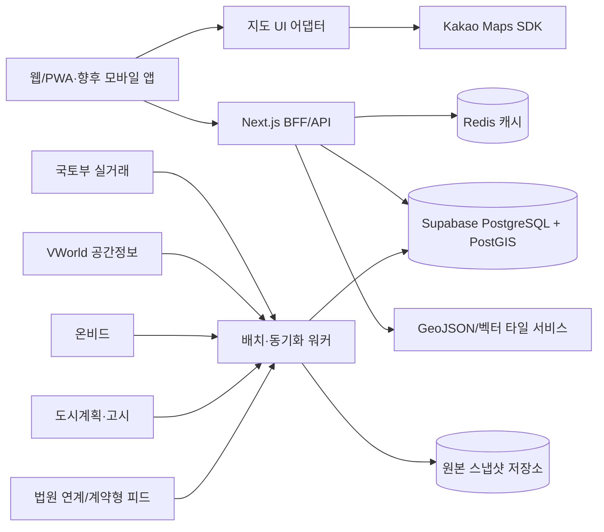

# Landview 지도·부동산 데이터 플랫폼 구현 계획

- 조사 기준일: 2026-07-22
- 대상: 현재 Next.js + Vercel 기반 Landview 웹사이트와 이후 모바일 앱
- 핵심 범위: 지도, 필지, 실거래가, 토지이용계획, 개발정보, 온비드 공매, 법원경매

## 1. 결론

현재 조사한 **카카오맵 + VWorld + 국토교통부 실거래가 + 온비드** 조합은 국내 토지 서비스의 MVP를 만들기에 적합하다. 다만 각 외부 API의 응답을 화면에서 직접 조합하면 공급자 교체, 호출 제한, 좌표계 차이, 주소 불일치 때문에 곧 유지보수가 어려워진다.

권장 구성은 다음과 같다.

1. 카카오맵은 사용자가 보는 기본 지도와 장소·주소 검색에 사용한다.
2. VWorld는 연속지적도, 용도지역·지구, 도시계획시설 등 공간 레이어에 사용한다.
3. 공공데이터포털의 국토부 API는 토지·주택 실거래 원천 데이터에 사용한다.
4. 온비드는 공매 물건과 입찰 일정의 공식 출처로 사용한다.
5. 법원경매는 공식 공개 API가 확인되기 전까지 공식 사이트 연결과 제한된 수동 등록으로 시작하고, 법원행정처 연계 API 또는 계약형 민간 데이터 공급사를 별도 어댑터로 붙인다.
6. 모든 데이터를 서버에서 **PNU(필지고유번호)** 중심으로 정규화한 뒤 PostgreSQL/PostGIS에 저장한다.
7. 전국을 한 번에 수집하지 않고 1~2개 시군구를 파일럿 지역으로 잡아 데이터 결합 정확도와 API 사용량을 먼저 검증한다.

Landview의 차별점은 지도 위에 마커를 많이 올리는 것이 아니라, 한 필지를 선택했을 때 **거래·규제·계획·공매·경매를 출처와 신뢰도까지 포함한 ‘필지 리포트’로 묶어 보여주는 것**이어야 한다.

## 2. 권장 API 조합

| 영역 | 1순위 | 용도 | 주의점 | 대안 |
|---|---|---|---|---|
| 기본 지도 | Kakao Maps SDK | 국내 친숙한 지도 UI, 주소·장소 검색, 웹/앱 지도 | 2026-07-21부터 이용량·과금 체계 변경. 앱·도메인 등록과 키 제한 필요 | 네이버 지도, MapLibre |
| 지적·용도지역 | VWorld 2D Data API, WMS/WFS | 연속지적도, 용도지역·지구, 도시계획시설, 건물 공간정보 | 법적 경계·측량 결과가 아닌 참고자료. 좌표계와 이용 조건 확인 | 국가공간정보포털 다운로드, 자체 PostGIS 적재 |
| 주소·좌표 | Kakao Local API | 화면 검색, 주소↔좌표, POI 검색 | 검색 편의 기능으로 사용하고 영구 결합키로 쓰지 않음 | [도로명주소 개발자센터](https://business.juso.go.kr/), VWorld 지오코더 |
| 토지 실거래 | 국토부 토지 매매 실거래 API | 법정동·계약월별 토지 거래 | 일부 지번 비공개, 해제·정정 가능, 월별 재수집 필요 | 실거래가 공개시스템 다운로드 |
| 공동주택 실거래 | 국토부 아파트 매매 실거래 API | 비교 가격, 주변 주거 거래 | 토지 가격과 단순 비교 금지 | 연립다세대·단독다가구 API 추가 |
| 토지 규제 | 토지이용규제정보 API + VWorld | 행위제한, 용도지역·지구, 토지이용계획 | 화면에 ‘참고용’ 표시 및 토지이음 원문 연결 | 토지이음 직접 확인 링크 |
| 개발정보 | 도시계획시설 WMS/WFS + 도시계획 공고 파일 | 시설 결정, 개발사업 구역, 고시·공고 | ‘개발 확정’으로 과장하지 말고 결정 상태·공고일 표시 | 지자체 고시공고·보도자료 보강 |
| 공매 | 온비드 물건·공고·입찰 API | 공매 물건, 감정가, 최저입찰가, 일정 | 차세대 온비드 전환에 맞춰 엔드포인트별 확인 필요 | 온비드 원문 링크 |
| 법원경매 | 법원행정처 연계 API 협의 | 사건·기일·진행 상태 | 현재 셀프서비스형 공개 경매 API는 확인되지 않음 | 공식 링크 MVP, 계약형 민간 피드 |
| 인구·상권 | SGIS 개발지원센터 API | 인구, 가구, 주택, 사업체 통계 | 통계 경계·기준연도 표시 | KOSIS, 지자체 열린데이터 |
| 재해·안전 | 생활안전지도·공공 공간데이터 | 침수, 재해, 안전 관련 레이어 | 데이터별 해상도와 갱신일이 다름 | 환경·산림 분야 공공 API |

### 2.1 카카오맵의 역할

[Kakao Maps API](https://developers.kakao.com/docs/ko/kakaomap/common)는 Web JavaScript SDK와 Android/iOS SDK를 제공하므로 웹에서 시작해 앱으로 확장하기 좋다. [Kakao Local API](https://developers.kakao.com/docs/ko/local/dev-guide)는 주소 검색, 좌표 변환, 키워드·카테고리 장소 검색에 적합하다.

권장 사용 범위:

- 기본 지도와 지도 조작 UI
- 주소 및 장소 검색
- 선택 위치의 역지오코딩
- 마커·클러스터·간단한 폴리곤 표현
- 모바일 앱 구축 시 Kakao Native SDK 활용

카카오 지도에 비즈니스 로직을 종속시키지는 않는다. 내부 API는 `GeoJSON` 또는 표준 DTO를 반환하고, 지도 컴포넌트만 Kakao SDK 형식으로 변환한다. 이렇게 해야 네이버 지도나 MapLibre로 바꿀 때 데이터 계층을 다시 만들지 않는다.

또한 2026-07-21부터 지도 API 이용량·과금 정책이 변경되었으므로 출시 전에 최신 콘솔 정책을 다시 확인해야 한다. 브라우저에 노출되는 JavaScript 키는 허용 도메인을 제한하고, REST 키는 서버에서만 사용한다.

### 2.2 VWorld의 역할

[VWorld 2D Data API](https://www.vworld.kr/dev/v4dv_2ddataguide2_s001.do)는 연속지적도, 용도지역·지구, 도시계획시설 등 다수의 국가 공간정보 레이어를 제공한다. 대용량 공간 표현은 [WMS/WFS 서비스](https://www.data.go.kr/data/15058805/openapi.do)를 함께 검토한다.

우선 적용할 레이어:

- 연속지적도: 필지 경계와 PNU 확보
- 용도지역·지구: 도시지역, 관리지역, 농림지역, 자연환경보전지역 등
- 도시계획시설: 도로, 공원, 철도, 학교 등
- 지구단위계획·개발사업 관련 구역
- 건물통합정보: 건물 외곽과 공간 결합 보조
- 개별공시지가·토지특성: 가격 및 토지 속성 보조

중요한 제한:

- 연속지적도는 측량이나 소유권 판단용 법적 경계가 아니라 참고자료다. 화면과 보고서에 이를 명시한다.
- [VWorld 지오코더](https://www.vworld.kr/dev/v4dv_geocoderguide2_s001.do)는 실시간 이용 조건이며 결과를 별도 DB에 저장하는 용도로 쓰지 않는다. 영구 저장이 필요한 주소 정규화는 이용 조건상 저장 가능한 원천 데이터나 자체 주소 DB로 처리한다.
- 공급자 WMS를 카카오 지도 위에 바로 중첩할 때 CORS, 투영법, 축척, 저작권 표시를 검증한다. 문제가 있으면 이용 조건 범위에서 서버 타일 어댑터 또는 PostGIS 기반 벡터 타일로 전환한다.

### 2.3 국토교통부 실거래가의 역할

[국토교통부 토지 매매 실거래가 API](https://www.data.go.kr/data/15126466/openapi.do)는 5자리 법정동 코드와 계약 연월을 기준으로 조회한다. 아파트 비교가 필요하면 [아파트 매매 실거래가 API](https://www.data.go.kr/data/15126469/openapi.do)도 별도 수집한다.

1차 지도 표시 범위:

| 지도 레이어 | 공식 API | 1차 표시 정보 |
|---|---|---|
| 건물 | [아파트 매매 실거래가](https://www.data.go.kr/data/15126469/openapi.do) | 거래금액, 전용면적, 층, 계약일, ㎡·평당 단가 |
| 상가·업무용 | [상업업무용 부동산 매매 실거래가](https://www.data.go.kr/data/15126463/openapi.do) | 건물용도, 건물·토지면적, 거래금액, 계약일 |
| 토지 | [토지 매매 실거래가](https://www.data.go.kr/data/15126466/openapi.do) | 지목, 거래면적, 거래금액, 계약일, ㎡·평당 단가 |

- 선택 필지 PNU의 앞 5자리를 `LAWD_CD`로 사용하고 최근 3개월을 기본 조회 범위로 한다.
- 지도에는 `건물`, `상가·업무`, `토지` 필터와 거래금액 마커를 제공한다.
- 거래 마커를 선택하면 계약일, 면적, 총액, 단위면적당 가격과 데이터 출처를 표시한다.
- API가 좌표를 직접 제공하지 않으므로 공개된 지번으로 PNU를 구성하거나 주소를 좌표로 변환한다.
- 개인정보 보호로 지번이 일부 가려진 상가·토지 거래는 정확한 필지 마커로 표시하지 않고 지역 단위 목록·집계로 구분한다.
- 연립·다세대, 단독·다가구, 오피스텔, 공장·창고는 1차 구조 검증 후 같은 형식으로 확장한다.

수집 원칙:

- API를 사용자의 지도 이동마다 직접 호출하지 않고 서버 배치로 수집한다.
- 최근 3~6개월은 해제·정정 신고를 반영하도록 반복 수집한다.
- 원본 응답, 수집 시각, 데이터 해시를 남겨 변경 이력을 추적한다.
- 지번이 가려진 거래는 특정 필지에 억지로 매칭하지 않는다.
- `EXACT`, `PARTIAL`, `REGION_ONLY` 등 매칭 신뢰도를 함께 저장하고 UI에 표시한다.
- 거래금액은 면적당 가격과 함께 보여주되 지목, 용도지역, 도로접면 등 조건이 다름을 안내한다.

[실거래가 공개시스템](https://rt.molit.go.kr/pt/xls/xls.do)의 데이터는 신고 해제·정정으로 바뀔 수 있으므로 일회성 수집본을 확정값처럼 다루면 안 된다.

### 2.4 토지이용계획과 개발정보

규제 정보는 [토지이용규제정보 행위제한 API](https://www.data.go.kr/data/15058410/openapi.do), 공간 경계는 VWorld 용도지역·지구 레이어, 최종 확인은 [토지이음](https://www.eum.go.kr/web/am/amMain.jsp?mi=11113) 원문으로 연결한다.

개발정보는 하나의 API로 완성되지 않는다. 다음 정보를 결합해 ‘개발 신호’로 제공한다.

- [도시계획시설 WMS/WFS](https://www.data.go.kr/data/15057507/openapi.do)
- [토지이용계획 지도 API](https://www.data.go.kr/data/15057876/openapi.do)
- [도시계획 공고 데이터](https://www.data.go.kr/data/15130432/fileData.do)
- 지자체 고시·공고 원문 URL
- 필요 시 산업단지, 택지개발, 철도·도로 사업의 개별 공식 데이터

개발정보 UI에는 반드시 `계획`, `결정`, `고시`, `공사`, `완료`, `변경/취소`처럼 상태를 나누고, 공고일과 출처를 표시한다. 단순히 구역 안에 포함된 사실을 ‘개발 호재’나 가격 상승 보장으로 표현하지 않는다.

### 2.5 온비드 공매

공매는 구 서비스 대신 2026년에 등록된 차세대 온비드 API를 기준으로 구현한다.

| 우선순위 | 서비스 | Base URL 식별자 | 용도 |
|---|---|---|---|
| 필수 | [부동산 물건목록](https://www.data.go.kr/data/15157207/openapi.do) | `OnbidRlstListSrvc2` | 현재 입찰 중·입찰 예정 부동산 검색 |
| 필수 | [부동산 물건상세](https://www.data.go.kr/data/15157247/openapi.do) | `OnbidRlstDtlSrvc2` | 소재지, 면적, 최저입찰가, 감정평가, 사진 |
| 필수 | [물건상세 입찰정보](https://www.data.go.kr/data/15157251/openapi.do) | `OnbidCltrBidDtlSrvc2` | 입찰방법, 제한정보, 회차별 일정 |
| 후속 | [공고목록](https://www.data.go.kr/data/15157216/openapi.do) | `OnbidPbancListSrvc2` | 공고와 개찰 일정 검색 |
| 후속 | [공고상세](https://www.data.go.kr/data/15157218/openapi.do) | `OnbidPbancDtlnfSrvc2` | 공고문과 첨부파일 정보 |
| 후속 | [입찰 결과목록](https://www.data.go.kr/data/15157222/openapi.do) | `OnbidPbancBidRsltListSrvc2` | 개찰·낙찰 결과와 상태 갱신 |
| 보조 | [코드·주소](https://www.data.go.kr/data/15157768/openapi.do) | `OnbidCodeSrvc` | 재산유형, 용도, 지역 검색 코드 |

표시할 핵심 필드:

- 물건번호와 관리기관
- 물건 종류와 소재지
- 감정가, 최저입찰가, 유찰 횟수
- 입찰 시작·마감일과 개찰일
- 진행 상태
- 원문 상세 페이지 링크
- PNU 또는 주소 기반 공간 매칭 결과와 신뢰도

MVP에서는 물건목록, 물건상세, 물건상세 입찰정보 3종부터 활용 신청한다. 물건 상태가 자주 바뀌므로 1~3시간 간격으로 동기화하고, 종료된 물건도 마지막 상태를 다시 확인한다. 실제 활용 신청 후 샘플 응답과 운영 엔드포인트를 확인하고 `OnbidAdapter` 내부에서 공급자 응답을 공통 스키마로 변환한다.

## 3. 법원경매 데이터 확보 전략

### 조사 결과

[법원 경매정보](https://www.courtauction.go.kr/)는 공식 조회 사이트지만, 경매 물건 전체를 상업 서비스가 즉시 호출할 수 있는 공개 Open API는 확인되지 않았다. [법원행정처 사법정보공유포털](https://openapi.scourt.go.kr/kgso201m01.do)은 사건 기본정보·진행정보 등의 연계 API를 안내하며, [이용 절차](https://openapi.scourt.go.kr/kgso202m01.do)에 따르면 연계 API는 `publicapi@scourt.go.kr`로 문의해야 하고 셀프서비스형 Open API는 추후 제공 예정으로 안내되어 있다.

따라서 화면을 볼 수 있다는 사실을 데이터 재배포 허용으로 해석해서는 안 된다. CAPTCHA 우회, 과도한 자동조회, 개인정보 재가공, 매각물건명세서·등기 문서의 무단 재배포도 피한다. [사법정보공유포털 이용약관](https://openapi.scourt.go.kr/kgso000m02.do)과 [저작권 정책](https://openapi.scourt.go.kr/kgso000m04.do)을 서비스 출시 전 다시 검토한다.

### 권장 순서

#### 1단계: 공식 링크 기반 MVP

- 법원, 사건번호, 물건번호, 기일, 기본 주소만 운영자가 등록할 수 있게 한다.
- 사용자는 Landview에서 주변 실거래·토지이용·개발계획을 보고, 상세 법적 문서는 법원경매 공식 원문에서 확인하게 한다.
- 자동 수집이 아닌 명시적 입력과 공식 링크로 제품 가치를 먼저 검증한다.

#### 2단계: 법원행정처 연계 API 협의

- `publicapi@scourt.go.kr`로 서비스 목적, 예상 호출량, 보관 기간, 상업 이용 여부를 적어 문의한다.
- 경매 사건·물건·매각기일·진행상태 API 제공 가능 여부를 구체적으로 확인한다.
- 제공 범위와 이용 조건을 서면으로 받은 뒤 `CourtAuctionAdapter`를 구현한다.

#### 3단계: 계약형 민간 데이터 피드

- 공식 연계 범위가 부족하면 지지옥션, 옥션원, 스피드옥션 등 경매정보 사업자에 B2B API 또는 데이터 피드 제공 여부를 문의한다.
- API가 있다는 전제로 개발하지 말고 계약서에서 상업 이용, 가공, 캐시, 지도 표시, 재배포, 데이터 삭제 조건을 확인한다.
- 공급자가 바뀌어도 화면과 DB를 유지할 수 있도록 내부 표준 스키마로 변환한다.

#### 하지 않을 방식

- 법원경매 사이트 무단 대량 크롤링
- CAPTCHA나 접근 제한 우회
- 개인 식별 정보의 불필요한 저장·노출
- 법원 문서 원문을 권리 확인 없이 자체 서버에서 재배포
- 민간 포털 화면을 크롤링해 재판매

## 4. 더 나은 대안과 확장 아이디어

### 지도 엔진 대안

#### 옵션 A: Kakao Maps 유지 — MVP 추천

국내 사용자가 익숙하고 주소·장소 검색 품질이 좋다. 기존 Next.js 웹과 빠르게 결합할 수 있다. 지도 계층을 어댑터로 분리해 비용이나 정책이 바뀌면 교체할 수 있게 한다.

#### 옵션 B: Naver Maps

[Naver Maps JavaScript API](https://navermaps.github.io/maps.js.ncp/)는 지적편집도, 교통, 파노라마, 사용자 정의 타일·데이터 레이어를 제공한다. 부동산 서비스에서 네이버 생태계와 파노라마가 중요하면 좋은 대안이다. 실제 선택은 같은 지역·같은 기능으로 검색 품질, 지도 표현, 비용을 비교한 뒤 결정한다.

#### 옵션 C: MapLibre + 자체 타일

[MapLibre GL JS](https://maplibre.org/maplibre-gl-js/docs)는 오픈소스 WebGL 지도 렌더러다. 대량 필지·용도지역 폴리곤, 벡터 타일 스타일링, 웹·네이티브 공통 설계를 가장 자유롭게 할 수 있다. 대신 기본 지도 타일, 한글 POI, 검색, 타일 호스팅과 라이선스를 직접 해결해야 하므로 전국 규모 확장 단계에 더 적합하다.

### 제품 기능 아이디어

1. **필지 리포트**: 한 필지의 면적, 지목, 공시지가, 실거래, 용도지역, 행위제한, 개발계획, 공·경매를 한 화면에 제공한다.
2. **가격 비교판**: 감정가·최저입찰가·공시지가·인근 실거래 ㎡당 가격을 같은 기준으로 비교한다. 자동으로 ‘저평가’라고 단정하지 않는다.
3. **개발 공고 타임라인**: 필지 반경 안의 도시계획 결정·변경·고시를 시간순으로 보여준다.
4. **관심지역 알림**: 새 실거래, 공매·경매 물건, 입찰기일 변경, 개발 공고를 알림으로 보낸다.
5. **필지 비교**: 2~4개 필지를 선택해 규제, 가격, 도로접면, 계획시설 포함 여부를 비교한다.
6. **데이터 신뢰도 배지**: 공식 원문, 갱신일, 정확/추정 매칭, 참고용 여부를 눈에 띄게 표시한다.
7. **생활·상권 맥락**: [SGIS 개발지원센터](https://sgis.mods.go.kr/developer/html/openApi/api/intro.html)의 인구·가구·주택·사업체 통계를 읍면동 또는 격자 단위로 보강한다.
8. **재해·입지 레이어**: 침수·산사태·경사도·도로 접근성 등 실사 전에 확인할 항목을 체크리스트로 제공한다.
9. **원문 중심 실사 체크리스트**: 토지이음, 대법원, 온비드, 지자체 고시 등 반드시 직접 확인할 원문으로 연결한다.
10. **변경 이력**: 거래 취소, 입찰 상태 변경, 도시계획 변경을 단순 덮어쓰지 않고 타임라인으로 남긴다.

## 5. 데이터 결합 기준

### PNU를 중심키로 사용

주소 문자열은 띄어쓰기, 도로명·지번 혼용, 산번지, 대표번지 때문에 결합키로 부적합하다. 필지 데이터의 내부 중심키는 19자리 PNU로 통일한다.

PNU 구조:

```text
법정동코드 10자리 + 토지구분 1자리(일반/산) + 본번 4자리 + 부번 4자리
```

외부 데이터에 PNU가 없으면 다음 순서로 매칭한다.

1. 제공된 법정동 코드·지번으로 PNU 구성
2. 좌표가 있으면 필지 폴리곤과 공간 조인
3. 정규화한 주소로 후보 생성
4. 확정할 수 없으면 필지에 귀속하지 않고 지역 단위 자료로 유지

### 좌표계 원칙

- API와 웹 전달 표준: EPSG:4326
- 지도 화면: 지도 SDK가 요구하는 좌표계로 변환
- 거리·면적 연산: PostGIS에서 적합한 국내 투영좌표계로 변환 후 계산
- 원본 좌표계, 변환 시각, 변환 방법을 메타데이터로 남김

### 출처와 신뢰도

모든 핵심 레코드에 아래 필드를 둔다.

```text
source_provider
source_dataset
source_record_id
source_url
source_updated_at
collected_at
match_level
legal_notice
raw_snapshot_id
```

## 6. 권장 시스템 아키텍처



### 구성 요소

- **Supabase PostgreSQL + PostGIS**: PNU 중심 데이터, 공간 검색, 자체 회원·세션·후기 저장
- **회원·후기 서버 계층**: Supabase Auth와 RLS 없이 Next.js 서버가 인증·인가를 수행한다. 세부 설계는 [회원가입·로그인·후기 구현 계획](./auth-review-implementation-plan.md)을 따른다.
- **동기화 작업**: 국토부·온비드·개발정보를 정기적으로 수집하고 변경 이력을 반영
- **Redis**: 동일 지도 영역 반복 조회 캐시와 외부 API 호출량 보호
- **원본 저장소**: S3 또는 R2에 수집 원본과 체크섬 보관
- **타일 계층**: 초기에는 작은 영역을 GeoJSON으로 반환하고, 데이터가 커지면 `pg_tileserv` 또는 `Tegola` 기반 벡터 타일로 전환

## 7. 핵심 데이터 모델

### `parcels`

```text
pnu PK
legal_dong_code
san_flag
main_lot_no
sub_lot_no
lot_address
land_category
area_m2
geom
centroid
source_updated_at
```

### `transactions`

```text
id PK
property_type
deal_date
deal_amount_krw
area_m2
price_per_m2
lawd_code
lot_text_masked
matched_pnu NULL
match_level
cancellation_status
source_record_hash
source_updated_at
```

### `land_use_zones`

```text
id PK
zone_code
zone_name
geom
effective_date
source_layer_id
source_updated_at
```

필지와 용도지역은 폴리곤 공간 조인 결과를 별도 캐시 테이블에 보관할 수 있다. 하나의 필지가 여러 구역에 걸치는 경우 포함 면적과 비율을 함께 계산한다.

### `development_notices`

```text
id PK
notice_no
title
authority
notice_date
project_status
source_url
geom NULL
affected_pnu NULL
source_updated_at
```

### `auction_listings`

```text
id PK
source_type        # ONBID, COURT, LICENSED_VENDOR
external_id
court_name NULL
case_no NULL
item_no NULL
status
address_text
matched_pnu NULL
match_level
appraisal_price
minimum_bid_price
bid_start_at NULL
bid_end_at NULL
auction_date NULL
source_url
source_updated_at
```

### 운영 메타데이터

- `source_catalog`: 제공기관, 데이터셋, 이용약관, 쿼터, 갱신주기, 담당자
- `sync_runs`: 수집 시작·종료, 성공·실패 건수, 커서, 오류
- `raw_snapshots`: 원본 위치, 해시, 응답일
- `parcel_matches`: 원본 레코드와 PNU 후보, 매칭 방식, 신뢰도
- `favorites`, `alert_rules`, `alert_events`: 관심 필지·지역과 알림 이력

## 8. 현재 저장소에 적용할 모듈 구조

```text
app/
  map/page.tsx
  parcel/[pnu]/page.tsx
  api/
    map/parcels/route.ts
    map/layers/[layer]/route.ts
    parcels/[pnu]/route.ts
    transactions/route.ts
    auctions/route.ts
    development/route.ts

src/
  components/map/
    MapShell.tsx
    KakaoMap.tsx
    LayerControl.tsx
    ParcelInfoPanel.tsx
  lib/
    geo/
      coordinates.ts
      pnu.ts
    providers/
      kakao.ts
      vworld.ts
      molitRtms.ts
      onbid.ts
      courtAuction.ts
    db/
      queries/
  types/
    parcel.ts
    transaction.ts
    auction.ts
    development.ts

workers/
  sync-rtms/
  sync-onbid/
  sync-vworld/
  sync-development/
```

외부 공급자 응답 타입을 React 컴포넌트가 직접 사용하지 않게 한다. 각 `providers` 모듈이 공통 내부 타입으로 변환하고, API Route는 그 타입만 반환한다.

## 9. 환경변수 계획

실제 값은 저장소에 넣지 않고 Vercel 프로젝트 환경변수와 로컬 `.env`에만 둔다.

```dotenv
# 기존 문의 이메일
RESEND_API_KEY=
EMAIL_TO=

# 지도·주소 검색
NEXT_PUBLIC_KAKAO_MAP_APP_KEY=
KAKAO_REST_API_KEY=

# 공간정보
VWORLD_API_KEY=
VWORLD_DOMAIN=

# 공공데이터포털
DATA_GO_KR_SERVICE_KEY=
ONBID_SERVICE_KEY=

# 저장·캐시
DATABASE_URL=
REDIS_URL=
OBJECT_STORAGE_BUCKET=

# Supabase 회원·세션·후기 — 서버 전용
SUPABASE_URL=
SUPABASE_SECRET_KEY=
APP_URL=http://localhost:3000
AUTH_PASSWORD_PEPPER=
AUTH_SESSION_TTL_DAYS=14
AUTH_EMAIL_FROM=

# 법원 연계 또는 계약형 공급자 확정 이후
COURT_AUCTION_PROVIDER_API_KEY=
```

- `NEXT_PUBLIC_` 접두사가 붙은 값은 브라우저에 공개된다고 가정하고 도메인을 제한한다.
- 공공데이터·온비드·DB 키는 서버와 워커에서만 사용한다.
- Supabase Auth와 브라우저용 Supabase 클라이언트는 사용하지 않는다. `SUPABASE_SECRET_KEY`는 Next.js 서버 전용이며 클라이언트 번들에 포함하면 안 된다.
- 회원·세션·후기 테이블은 RLS를 사용하지 않는다. 대신 `anon`, `authenticated` 역할의 테이블 권한을 회수하고 서버의 `service_role` 접근만 허용한다.
- 온비드가 공공데이터포털 공통 키를 쓰더라도 코드에서는 별도 이름으로 추상화해 공급자 교체에 대비할 수 있다.
- `.env.example`에는 변수명만 적고 실제 키를 커밋하지 않는다.

### API 활용 신청 순서

| 순서 | 활용 신청·설정 | 필요한 기능 |
|---|---|---|
| 1 | Kakao Developers 앱과 Kakao Maps 활성화 | Web SDK, 주소·좌표, 장소 검색 |
| 2 | VWorld 인증키 | 연속지적도 `LP_PA_CBND_BUBUN`, 용도지역 `LT_C_UQ111`~`LT_C_UQ114`, WMS/WFS |
| 3 | [국토부 아파트 매매](https://www.data.go.kr/data/15126469/openapi.do), [상업업무용 매매](https://www.data.go.kr/data/15126463/openapi.do), [토지 매매](https://www.data.go.kr/data/15126466/openapi.do) | 건물·상가·토지 거래금액·면적·계약일 |
| 4 | [토지이용규제정보서비스](https://www.data.go.kr/data/15058410/openapi.do) | 지역지구별 행위제한 |
| 5 | 차세대 온비드 필수 3종 | 공매 물건목록·상세·입찰정보 |
| 6 | PostgreSQL/PostGIS | PNU 중심 데이터와 공간검색 저장소 |
| 7 | 개별공시지가·토지특성·건축물대장 | 필지 상세 리포트 강화 |
| 8 | 도시계획시설·개발 고시 | 개발정보와 변경 알림 |
| 별도 | 법원행정처 `publicapi@scourt.go.kr` 문의 | 경매 사건·물건·기일 API 제공 가능 여부 확인 |

공공데이터포털 인증키를 사용하더라도 필요한 데이터셋은 각각 활용 신청한다. 실거래가와 온비드는 정기 동기화 대상으로 관리하고, Kakao 지도는 사용자 지도 화면에 연결한다.

## 10. 단계별 구현 로드맵

### 0단계 — 데이터 검증과 이용 신청 (1주)

목표: 코드를 많이 만들기 전에 데이터가 실제로 결합되는지 확인한다.

- 파일럿 지역 1~2개 시군구 선정
- Kakao, VWorld, 공공데이터포털, 온비드 키 발급과 운영 쿼터 확인
- 각 API 샘플 100건 저장 및 필드 사전 작성
- PNU 생성·검증 규칙 확정
- 좌표계와 공간 레이어 중첩 시험
- 데이터셋별 저장·캐시·재배포 조건 표 작성
- 법원행정처에 경매 연계 API 문의 발송

완료 기준:

- 같은 필지에서 지적도, 토지이용, 실거래 샘플이 일관되게 연결된다.
- 이용 조건과 출처 표시 문구가 정리된다.
- 법원경매는 공식 연계 회신 전에도 진행 가능한 MVP 범위가 확정된다.

### 1단계 — 지도와 필지 탐색 MVP (2~3주)

- `/map` 페이지와 반응형 전체 지도
- 주소·장소 검색
- 지도 클릭으로 필지 선택
- 연속지적도, 용도지역·지구, 도시계획시설 레이어 토글
- 필지 기본정보 사이드 패널/모바일 바텀시트
- URL에 중심 좌표·줌·PNU 상태 반영
- 출처, 갱신일, 참고용 안내 표시

완료 기준:

- 데스크톱과 모바일에서 검색→필지 선택→정보 확인 흐름이 동작한다.
- 지도 확대·이동 시 요청 취소, 디바운스, 캐시가 작동한다.
- 한 화면에 지나치게 많은 도형을 내려받지 않는다.

### 2단계 — 실거래가 적재와 분석 (2~3주)

- 아파트·상업업무용·토지 실거래 월별 수집
- 최근 월 재수집과 취소·정정 처리
- PNU 정확/부분/지역 매칭 파이프라인
- 지도 거래금액 마커·클러스터와 건물/상가/토지·기간·면적 필터
- 필지 및 주변 거래 추이
- ㎡당 가격, 중앙값, 표본 수 표시

완료 기준:

- 중복 수집이 발생하지 않는 멱등성 보장
- 가려진 지번을 정확한 필지처럼 노출하지 않음
- 수집 실패 재시도와 소스별 상태 모니터링

### 3단계 — 온비드 공매 (약 2주)

- 물건·공고·입찰 일정 동기화
- 주소/PNU 매칭
- 감정가·최저입찰가·유찰·마감 필터
- 실거래·공시지가와 동일 단위 비교
- 온비드 공식 원문 연결
- 관심 물건과 입찰 마감 알림

완료 기준:

- 상태가 종료된 물건이 신규처럼 보이지 않는다.
- 가격과 일정에 출처 갱신 시각이 표시된다.

### 4단계 — 개발계획과 규제 (2~3주)

- 용도지역별 행위제한 요약
- 도시계획시설과 개발사업 경계
- 지자체·국가 고시 타임라인
- 선택 필지 및 반경 내 계획 검색
- 새 공고·상태 변경 알림

완료 기준:

- 계획 단계와 확정·공사 단계를 구분한다.
- 모든 개발 항목에 공식 원문과 공고일이 있다.

### 5단계 — 법원경매 (외부 협의와 병행)

- 초기: 사건번호 수동 등록, 공식 사이트 딥링크, 주변 분석 제공
- 승인 시: 법원 연계 API 어댑터 구현
- 미승인 또는 데이터 부족 시: 계약형 공급자 비교·계약 후 어댑터 구현
- 사건 진행, 매각기일, 최저가 변경 이력과 알림

완료 기준:

- 데이터 수집·가공·노출 권한이 서면으로 확인된다.
- 공급자를 바꿔도 `auction_listings`와 화면 계약이 유지된다.

### 6단계 — 사용자 기능과 앱 확장 (2~4주)

- 자체 `users` 테이블 기반 회원가입·이메일 인증·로그인
- Supabase Auth와 RLS를 사용하지 않는 DB 세션·서버 인가
- 로그인 사용자 후기 작성·수정·삭제와 공개 후기 목록
- 메인 홈의 평균 평점·후기 수·최신 공개 후기 3개
- 관심 필지·지역, 저장 검색
- 이메일·푸시 알림 설정
- 필지 비교와 공유 링크
- 설치형 PWA 우선 적용
- 사용성과 리텐션이 검증되면 React Native 또는 Flutter 앱 검토
- 모바일 앱도 동일한 Landview API와 내부 DTO 사용

회원·세션·후기 테이블, 서버 API, 쿠키, 권한 회수, 보안 테스트의 상세 기준은 [회원가입·로그인·후기 구현 계획](./auth-review-implementation-plan.md)에 정의한다.

## 11. 테스트 계획

### 데이터·계약 테스트

- 외부 API별 고정 샘플 응답으로 파서 계약 테스트
- 필수 필드 누락, 타입 변경, XML/JSON 오류 대응
- PNU 생성: 일반번지, 산번지, 본번·부번, 대표번지 테스트
- 좌표 변환 왕복 및 알려진 경계점 검증
- 동일 수집 작업 반복 실행 시 중복 없음 확인

### 지도·성능 테스트

- 지도 이동 중 오래된 응답이 최신 화면을 덮지 않도록 요청 취소
- 줌별 레이어 최소·최대 표시 수준
- 모바일 저사양 기기에서 폴리곤 수와 프레임 확인
- GeoJSON 응답 크기 임계치 설정 후 벡터 타일 전환 기준 수립

### 운영·장애 테스트

- 외부 API 타임아웃, 429, 인증 오류별 재시도 정책
- 공급자 장애 시 마지막 성공 데이터와 갱신일 표시
- 일일 쿼터 70/90% 알림
- 배치 실행 결과와 레코드 증감률 모니터링
- 비정상 급증·급감 시 자동 공개 전 검토

### 법무·표시 QA

- 지도·데이터 출처와 저작권 표기
- ‘참고용이며 법적 효력이 없음’ 안내
- 법적 판단·투자 수익 보장 표현 금지
- 개인정보 최소수집 및 보존 기간 검토
- 외부 원문 링크가 정확한 기관 페이지를 가리키는지 확인

## 12. 우선순위 백로그

### P0 — 바로 착수

- [ ] 파일럿 시군구 선정
- [ ] API 키와 이용 신청 상태 정리
- [ ] `source_catalog` 작성
- [ ] PNU 유틸리티와 테스트 구현
- [ ] PostGIS 개발 DB 준비
- [ ] Kakao 지도 스켈레톤과 VWorld 연속지적도 PoC
- [ ] 법원행정처 연계 API 문의

### P1 — MVP

- [ ] 지도 검색과 필지 선택
- [ ] 필지 기본정보 패널
- [ ] 용도지역·도시계획 레이어 토글
- [ ] 토지 실거래 수집과 주변 거래 표시
- [ ] 데이터 출처·갱신일·신뢰도 컴포넌트
- [ ] 모바일 반응형 바텀시트

### P2 — 사업 가치 검증

- [ ] 온비드 물건 지도와 필터
- [ ] 감정가·최저가·실거래·공시지가 비교
- [ ] 관심 필지와 알림
- [ ] 개발 공고 타임라인
- [ ] 필지 비교·공유

### P3 — 확장

- [ ] 법원경매 정식 데이터 연동
- [ ] 벡터 타일 인프라
- [ ] SGIS 인구·사업체 분석
- [ ] 재해·입지 레이어
- [ ] 전국 수집 확대
- [ ] 네이티브 앱

## 13. 출시 판단 지표

기능 수보다 데이터 결합 품질을 먼저 본다.

- 필지 정확 매칭률과 부분·미매칭률
- 외부 데이터 최신성 SLA 준수율
- 지도 첫 표시와 이동 후 데이터 로드 시간
- 필지 리포트 열람률
- 관심 필지 저장률과 알림 재방문율
- 공식 원문 클릭률
- 외부 API 호출당 유효 사용자 조회 수
- 데이터 오류 신고 건수와 수정 소요 시간

## 14. 최종 권고

첫 출시 범위는 **카카오 지도 + VWorld 필지/용도지역 + 토지 실거래 + 온비드**로 제한한다. 개발정보는 공식 고시 기반으로 추가하고, 법원경매는 데이터 이용 권한이 해결될 때까지 공식 링크 기반으로 제공한다.

기술적으로 가장 먼저 만들어야 하는 것은 화려한 지도 화면이 아니라 다음 세 가지다.

1. PNU 중심의 안정적인 데이터 모델
2. 공급자별 API 어댑터와 수집 이력
3. 출처·갱신일·매칭 신뢰도를 사용자에게 보여주는 공통 UI

이 기반을 갖추면 웹/PWA에서 검증한 뒤 모바일 앱, 전국 단위 데이터, 벡터 타일, 유료 경매 데이터로 확장할 수 있다.

## 15. 공식 참고자료

- [Kakao Maps API 개요](https://developers.kakao.com/docs/ko/kakaomap/common)
- [Kakao Local API](https://developers.kakao.com/docs/ko/local/dev-guide)
- [Kakao 앱 키 보안 가이드](https://developers.kakao.com/docs/en/getting-started/security-guideline)
- [VWorld 2D Data API](https://www.vworld.kr/dev/v4dv_2ddataguide2_s001.do)
- [VWorld 지오코더](https://www.vworld.kr/dev/v4dv_geocoderguide2_s001.do)
- [국가공간정보 WMS/WFS API](https://www.data.go.kr/data/15058805/openapi.do)
- [연속지적도 데이터](https://www.data.go.kr/data/15056910/openapi.do)
- [용도지역·지구 WMS/WFS](https://www.data.go.kr/data/15123895/openapi.do)
- [도시계획시설 WMS/WFS](https://www.data.go.kr/data/15057507/openapi.do)
- [토지특성정보 서비스](https://www.data.go.kr/data/15123549/openapi.do)
- [개별공시지가정보 서비스](https://www.data.go.kr/data/15124014/openapi.do)
- [건축물대장정보 서비스](https://www.data.go.kr/data/15134735/openapi.do)
- [토지 매매 실거래가 API](https://www.data.go.kr/data/15126466/openapi.do)
- [아파트 매매 실거래가 API](https://www.data.go.kr/data/15126469/openapi.do)
- [토지이용규제정보 행위제한 API](https://www.data.go.kr/data/15058410/openapi.do)
- [토지이음](https://www.eum.go.kr/web/am/amMain.jsp?mi=11113)
- [온비드 물건정보 서비스](https://www.data.go.kr/tcs/dss/selectApiDataDetailView.do?publicDataPk=15000837)
- [온비드 공고·입찰정보 서비스](https://www.data.go.kr/data/15157256/openapi.do)
- [대한민국 법원 경매정보](https://www.courtauction.go.kr/)
- [법원행정처 사법정보공유포털](https://openapi.scourt.go.kr/kgso201m01.do)
- [SGIS 개발지원센터](https://sgis.mods.go.kr/developer/html/openApi/api/intro.html)
- [도로명주소 개발자센터](https://business.juso.go.kr/)
- [Naver Maps JavaScript API](https://navermaps.github.io/maps.js.ncp/)
- [MapLibre GL JS](https://maplibre.org/maplibre-gl-js/docs)
